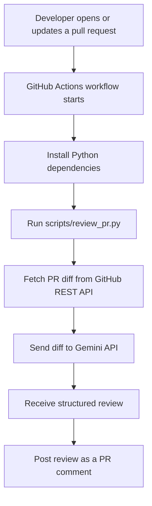

# GitHub PR Review Bot

An automated pull request review bot that uses the Gemini API to review code changes and post a structured review comment on GitHub PRs.

When a pull request is opened, reopened, or updated, GitHub Actions runs a Python script that fetches the PR diff, sends it to Gemini for review, and posts the generated feedback back to the pull request.

## Features

- Reviews pull requests automatically on open, reopen, and new commits
- Fetches the PR diff through the GitHub REST API
- Uses Gemini to generate a structured code review
- Posts the review as a GitHub PR comment
- Skips bot-authored PRs to avoid review loops
- Handles empty diffs safely
- Truncates large diffs before sending them to the AI model

## Architecture



## Project Structure

```text
.
|-- .github/
|   `-- workflows/
|       `-- pr-review.yml
|-- scripts/
|   `-- review_pr.py
|-- requirements.txt
`-- README.md
```

## Tech Stack

- Python 3.11
- GitHub Actions
- GitHub REST API
- Gemini API
- `google-genai`
- `requests`

## How It Works

1. A pull request event triggers `.github/workflows/pr-review.yml`.
2. The workflow installs dependencies from `requirements.txt`.
3. `scripts/review_pr.py` reads GitHub Actions environment variables.
4. The script fetches the PR diff from GitHub.
5. The diff is sent to Gemini with code-review instructions.
6. Gemini returns a markdown review.
7. The script posts that review as a PR comment.

## Required GitHub Secret

Create this repository secret in GitHub:

```text
GEMINI_API_KEY
```

You can create a Gemini API key from Google AI Studio:

```text
https://aistudio.google.com/app/apikey
```

Add it in:

```text
Repository Settings -> Secrets and variables -> Actions -> New repository secret
```

GitHub automatically provides `GITHUB_TOKEN`, so you do not need to create that manually.

## Environment Variables

| Variable | Source | Purpose |
| --- | --- | --- |
| `GITHUB_TOKEN` | GitHub Actions secret | Authenticates GitHub API requests |
| `GEMINI_API_KEY` | Repository secret | Authenticates Gemini API requests |
| `GITHUB_REPOSITORY` | GitHub Actions context | Repository name in `owner/repo` format |
| `PR_NUMBER` | GitHub Actions context | Pull request number to review |
| `PR_AUTHOR` | GitHub Actions context | Used to skip bot-authored PRs |

## Workflow Permissions

The workflow uses these permissions:

```yaml
permissions:
  pull-requests: write
  issues: write
  contents: read
```

`issues: write` is required because GitHub PR comments are created through the Issues comments API.

## Testing

To test the bot:

1. Add the `GEMINI_API_KEY` secret to the repository.
2. Create a new branch.
3. Make a small code change.
4. Push the branch.
5. Open a pull request into `main`.
6. Open the Actions tab and wait for the workflow to complete.
7. Check the PR Conversation tab for an `AI PR Review` comment.

## Troubleshooting

If the workflow fails, open the failed GitHub Actions run and check the `Run AI PR review bot` step.

Common issues:

- Missing `GEMINI_API_KEY` secret
- Invalid Gemini API key
- Gemini API quota or rate-limit errors
- GitHub workflow permission errors
- Unsupported or unavailable Gemini model

If the workflow succeeds, the log should include:

```text
Fetching PR diff...
Sending to Gemini for review...
Posting comment to PR...
Review posted successfully!
```

## Current Model

The bot currently uses:

```text
gemini-3.5-flash
```

You can change the model in `scripts/review_pr.py` by updating `GEMINI_MODEL`.

## Future Improvements

- Add inline PR review comments on changed lines
- Filter out docs, lock files, and generated files
- Add labels based on the review verdict
- Support configurable model selection
- Add retry handling for temporary API failures
